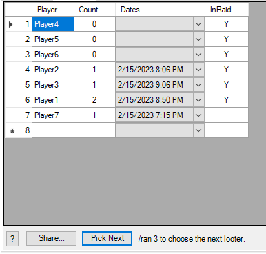
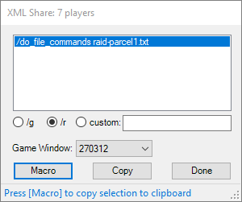
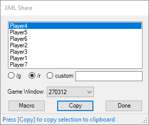
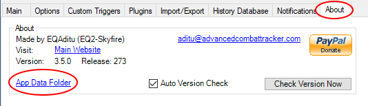
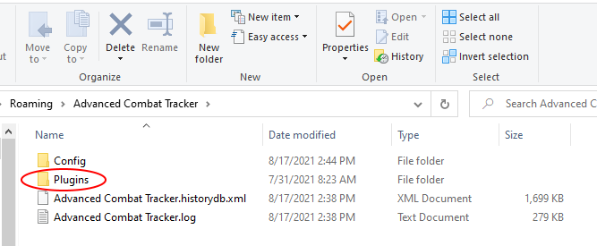
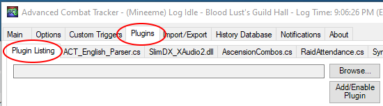
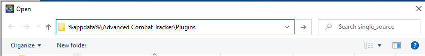

# Locked Parcel Plugin for Advanced Combat Tracker
This plugin was written to help track looting and distribution of the [Locked Parcels](https://u.eq2wire.com/item/index/4266886992) in EQII Renewal of Ro raids.

Each time someone loots a Locked Parcel, it is added to the plugin's list. The plugin tracks the number of times each player has looted one.

Players that have never looted a Locked Parcel are added to the list via the `/whoraid` command in EQII. The plugin trys to keep track of raid members, but the best way to update the list is with `/whoraid`.

The `[Pick Next]` button in the plugin sorts its list so that all of the players currently in the raid with the lowest count of looted Locked Parcels are at the top of the list. (i.e. it sorts by `InRaid`, then by `Count`, then by `Player`.) A message next to the `[Pick Next]` suggests a `/ran` EQII command to randomly select one of those raiders to recieve the next drop. An example is shown below where three players are in the raid and have never gotten a Locked Parcel, so they are at the top of the list:

# Sharing
The player list can be shared with other plugin users via the `[Share]` button. There are two methods of sharing; macro and copy/paste. These are described in the following sections.

When the __Game Window:__ is not blank, pressing the __[Macro]__ or __[Copy]__ button activates the selected game window. Once the game window is activated, the chat box can be activated by pressing the `Enter` key. (`Enter` is the default key binding. Use whatever key is set in _Options->Controls->Chat Keys->Begin Chat_.) The user can then press `Ctrl-v` to paste and `Enter` to complete the command.

### Share Channel
The plugin assumes you are sharing with the raid and chooses the prefix `/r`. This can be changed by selecting the appropriate button.
To paste in a different channel, use the `/g` for group or `custom` choice. For example, if you wanted to share with another player, you would select the `custom` button and enter `/tell AnotherPlayer` in the textbox.

### Macro Share
The entire list can be shared using the **[Macro]** button, as shown below:

The plugin's **[Macro]** button generally takes fewer steps to share a note. Pressing the **[Macro]** button generates enough text files to share the entire player list. The text file names follow the format `raid-parcelX.txt` where `X` is a number starting with 1 and incrementing until enough files are created to share the entire list, e.g. the first 16,000 or so characters would be shared using the macro file `raid-parcel1.txt`.

When the plugin finds an EQII game window, the share dialog initially opens with the list of macro commands.

To share using macros, the user follows the procedure below:
1. Verify or select the appropriate prefix.
2. Press the **[Macro]** button to put the selected command in the clipboard and activate the game window.
3. Press `Enter` to activate the game chat window.
4. Press `Ctrl-v` to paste the command.
5. Press `Enter` to finish the paste.
5. Continue from Step 2. The plugin automatically moves to the next line when the **[Macro]** button is pressed.
6. Repeat until all commands are pasted into game chat.
6. press **[Done]** to dismiss the dialog.

### Copy/Paste Player
Data for one player at a time is shared using the `[Copy]` button, as shown below:

To paste into a chat window, the sender needs to copy the appropirate line(s) from the plugin using the plugin's **[Copy]** button and then use `Ctrl-V` to paste it in the game chat window. 

In the example above, since a game window was found, the initial list contains the macro commands. Pressing the __[Copy]__ button switches the list to the player list. The user then follows the procedure below:
1. Verify or select the appropriate prefix
2. Press the **[Copy]** button to put the selected line in the clipboard and activate the game window.
3. Press `Enter` to activate the game chat window
4. Press `Ctrl-V` to paste the line.
4. Press `Enter` again to finish the paste.
5. Repeat from Step 2. The plugin automatically moves to the next line when the **[Copy]** button is pressed.
6. Repeat until all lines are pasted into game chat.
7. Press **[Done]** to dismiss the dialog.

Note that if a player has looted a lot of Locked Parcels (more than about 25), their name will show up more than once in the list. To transfer all of their data, each of the lines with their name must be copy/pasted.

# Installation

If you already have a version installed and enabled, the following sections are not relevant. You will get a prompt to update to the latest version when you run ACT.

Otherwise, the plugin must be manually downloaded and installed. 
The steps you will be taking are:
* Download the `Parcels.dll` file from the Releases page. 
  * You will need to leave this instructions page to do so.
* Install the downloaded file in ACT. 
  * Install instructions are on this page. Come back to this page after the download if you need to. 

Details are provided below. 

## Download

1. You might want to first read through all the steps since you will be leaving this page.
2. To go to the download page, click the following link: [Releases Page](https://github.com/jeffjl74/ACT_RoR_Parser/releases)
3. On the "Releases" page, for the __Latest release__, click the "Assets 3" title to expand the assets (if needed). 
The page with the expanded view will list three files.
4. Click the `Parsers.dll` link, download and save the file. 
	* Pay attention to where the file was downloaded. 
It will typically be in your "Downloads" folder.
In the Chrome browser, you can select _Show in folder_ after the download to open the folder in File Explorer.

## Add the plugin to ACT
### Move the downloaded file (optional)
The `Parcels.dll` file may be used right where you downloaded it, or use the following steps to put it in
the folder in which ACT normally saves plugins.

1. In Windows, open a File Explorer and browse to wherever you saved the `Parcels.dll` file, 
(typically the _Downloads_ folder) 
select it and choose either _Copy_ or _Cut_.
2. ACT's preferred folder is accessed from the _App Data Folder_ link in the About tab in ACT. Click that link, shown below:

3. Then double-click the _Plugins_ folder in File Explorer

4. Paste the `Parcels.dll` file in the _Plugins_ folder.

### Add/Enable the plugin in ACT
1. In ACT, click the "Plugins" tab and its "Plugin Listing" tab. 

2. Click the [Browse...] button and navigate to where you saved `Parcels.dll`
   * If you moved `Parcels.dll` to the _Plugins_ folder, you can get there by entering 
   `%appdata%\Advanced Combat Tracker\Plugins` 
   in the File Explorer navigation bar as shown below 

3. Select the `Parcels.dll` file and press [Open]. 
Then press the [Add/Enable Plugin] button. 

You should now have a `Parcels.dll` tab in your plugins tabs. Click on the tab to see the (empty) table. 

